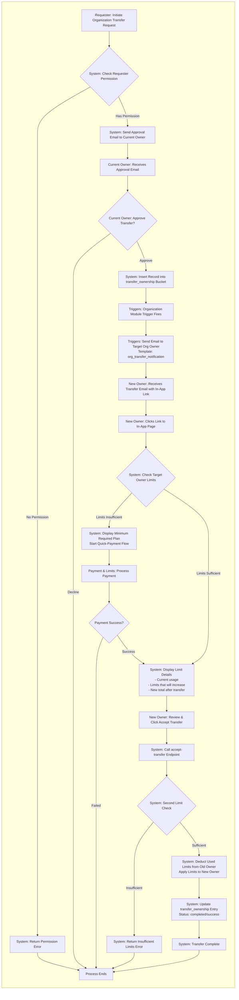
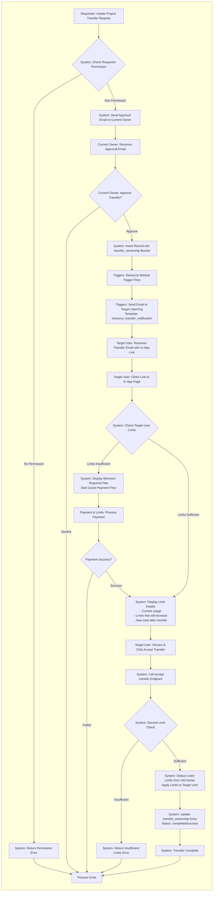

# Transfer Flow Documentation

## Overview

Two parallel transfer flows are documented:
1. **Organization Ownership Transfer Flow**
2. **Project/Assignment Transfer Flow**

Both flows share the same core logic and business rules, with minor variations in module triggers and recipient types.

## Flow Diagrams

The diagrams are created using Mermaid and illustrate the complete transfer process from initiation to completion.

### Key Components

#### Actors
- **Requester**: Initiates the transfer request
- **Current Owner**: Approves or declines the transfer
- **New Owner / Target User**: Receives and accepts the transfer
- **System**: Handles validation, checks, and processing
- **Triggers**: Module-level triggers (Organization Module or Resource Module)
- **Payment & Limits Service**: Manages payment processing and limit verification

## Transfer Flow Process

### 1. Initiation Phase
- Requester initiates a transfer request
- System validates requester's permission
- If unauthorized, returns permission error and ends process

### 2. Approval Phase
- System sends approval email to current owner
- Current owner reviews and approves/declines
- If declined, process ends
- If approved, proceeds to next phase

### 3. Database & Trigger Phase
- System inserts record into `transfer_ownership` bucket
- Module-level trigger fires:
  - **Organization Module Trigger** (for organization transfers)
  - **Resource Module Trigger** (for project/assignment transfers)
- Trigger sends notification email to recipient using appropriate template:
  - `org_transfer_notification` for organizations
  - `resource_transfer_notification` for projects/assignments

### 4. Recipient Review Phase
- Recipient receives email with in-app link
- Recipient clicks link to access in-app page
- System performs first limit check

### 5. Limit Verification & Payment (if needed)
- **If limits are insufficient:**
  - System displays minimum required plan
  - Initiates quick-payment flow
  - Processes payment through Payment & Limits Service
  - If payment fails, process ends
  - If payment succeeds, continues to display phase

- **If limits are sufficient:**
  - Proceeds directly to display phase

### 6. Information Display Phase
- System displays detailed information:
  - Current usage
  - Limits that will increase after transfer
  - New total limits after transfer
- Recipient reviews information

### 7. Acceptance Phase
- Recipient clicks "Accept Transfer"
- System calls `accept-transfer` endpoint

### 8. Final Validation & Execution
- System performs **second limit check** (safety measure)
- If insufficient, returns error and ends process
- If sufficient:
  - Deducts used limits from old owner
  - Applies limits to new owner/target user
  - Updates `transfer_ownership` entry with status: `completed/success`
  - Transfer complete

## Key Differences Between Flows

| Aspect | Organization Transfer | Project/Assignment Transfer |
|--------|----------------------|----------------------------|
| **Module Trigger** | Organization Module | Resource Module |
| **Email Template** | `org_transfer_notification` | `resource_transfer_notification` |
| **Recipient** | Target Organization Owner | Target User |
| **Limit Application** | Applied to Organization | Applied to Individual User |

## Technical Implementation Notes

### Database
- **Bucket**: `transfer_ownership`
- **Record Status**: `completed/success` upon successful transfer

### API Endpoints
- **accept-transfer**: Handles final acceptance and limit transfer logic

### Email Templates
- `org_transfer_notification`: Used for organization transfers
- `resource_transfer_notification`: Used for project/assignment transfers

### Security & Validation
- **Permission Check**: At initiation (requester must have transfer permission)
- **Approval Required**: Current owner must approve
- **Double Limit Check**: 
  1. Before displaying acceptance page
  2. Inside accept-transfer endpoint (safety measure)

### Limit Management
- Limits are deducted from the old owner
- Same limits are applied to the new owner/target user
- Payment flow integrates automatically for insufficient limits

## Error Handling

The flow includes multiple exit points for error scenarios:
- Permission denied at initiation
- Transfer declined by current owner
- Payment failure
- Insufficient limits at final check

## Mermaid Diagrams

### Organization Ownership Transfer Flow

### Project/Assignment Transfer Flow

## Usage

To view these diagrams:
1. Use any Mermaid-compatible viewer
2. GitHub automatically renders Mermaid diagrams in markdown files
3. Or use these tools:
   - [Mermaid Live Editor](https://mermaid.live/)
   - VS Code with Mermaid extension
   - Markdown preview tools
